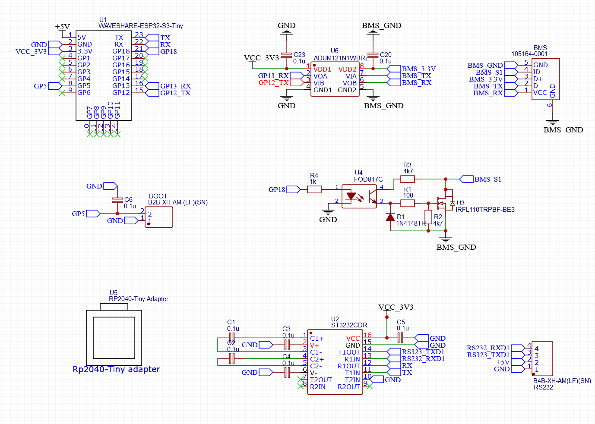
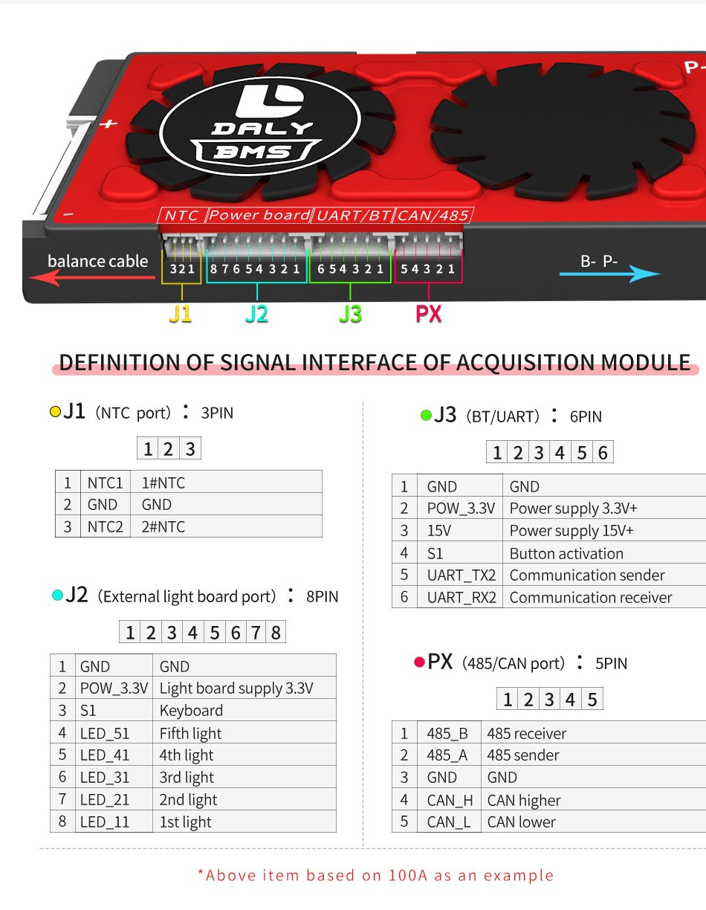

# uros_DalyBMS
This project is a micro-ROS interface for Daly SMARTBMS. Developed on the ESP-IDF framework to run on the ESP32 family of microcontrollers, it aims to provide a ROS service to obtain battery health information.

## Hardware
  
A hardware base using a [ESP32-S3-Tiny](https://www.waveshare.com/wiki/ESP32-S3-Tiny) from Waveshare has also been developed.

### Schematic
  

### BMS Interfaces
  
The connection interface to the BMS is achieved via a MOSFET optocoupler assembly for wake-up management and a digital isolator for serial communication. We reuse the USB Micro connector to connect the BMS to the board. On the BMS, the J3 pin is used, the pins are as follows:

- **J3-Pin_1** (GND): This pin serves as ground.
- **J3-Pin_3** (3.3V Power): This pin is only intermittently active when the BMS is not in sleep mode.
- **J3-Pin_2** (15V Power): This pin is not used.
- **J3-Pin_4** (S1): This pin is used to wake up the BMS. To do this, simply short it briefly to ground; this task is performed by the MOSFET in our case.
- **J3-Pin_5** (TX): This pin is used for UART TX connection.
- **J3-Pin_6** (RX): This pin is used for UART RX connection.

### ROS Host Interface
The connection interface to the ROS2 host running MicroROS_Agent uses an RS232 serial link. This link is also used to power the entire circuit and thus requires a 5V power supply.

### Discharge Activation Command
To give the user control over the load connected to the BMS, a manual command to activate the discharge MOSFETs has been implemented. 
Connecting the `BMS startup pin` to ground triggers an interrupt that executes the discharge MOSFET activation command. Note: The inverse action has not been implemented and should ideally be handled by a Watchdog ping from the agent via `rmw_uros_ping_agent`. Debouncing is handled in software.

### BMS Wake-Up
The BMS control circuit uses a sleep mechanism to save battery energy. To get a response when sending a command via UART at each execution of a ROS command or manual load startup, a wake-up is triggered via a sequence on the S1 pin.

## Firmware

### Configuration
The configuration of the various hardware and software parameters is done via `idf.py menuconfig`. Specific parameters such as GPIO numbers and serial configurations are set in the respective initialization functions of the different components.

### Components

We use different components in this project, managed via Git submodules:
- **ESP_DalyBMS**: C++ driver for DalyBMS.
- **ESP_IC_Led_RGB**: C++ driver for controllable LEDs.
- **micro_ros_espidf_component**: ESP-IDF component for micro-ROS.

### Compilation

To compile this firmware, follow these steps:
1. **Install dependencies**: Ensure that the ESP-IDF framework and micro-ROS are properly installed and configured.
2. **Add components**: Use `git submodule update --init --recursive` to initialize and update the components.
3. **Set target**: Use `idf.py set-target esp32s3` to set the target to ESP32S3.
4. **Configuration**: Use `idf.py menuconfig` to modify the "Component - LEDRGB settings" and "Component - DalyBMS GPIO Settings" as needed.
5. **Build**: Use `idf.py build` to compile your project.
6. **Flash**: Use `idf.py flash` to flash the firmware onto your ESP32.
7. **Monitor**: Use `idf.py monitor` to monitor the serial messages sent by the ESP32.

## MicroROS_Agent 
The MicroROS agent must be installed on the host running ROS2. To do this, follow the procedure below:

```sh
# Create a workspace and download micro-ROS
mkdir microros_ws 
cd microros_ws 
git clone -b $ROS_DISTRO https://github.com/micro-ROS/micro_ros_setup.git src/micro_ros_setup

# Update dependencies using rosdep
sudo apt update && rosdep update 
rosdep install --from-paths src --ignore-src -y

# Install pip
sudo apt-get install python3-pip

# Build micro-ROS tools and source them
colcon build 
source install/local_setup.bash

# Download micro-ROS-Agent packages
ros2 run micro_ros_setup create_agent_ws.sh

# Build micro-ROS-Agent and source them
ros2 run micro_ros_setup build_agent.sh 
source install/local_setup.bash
```

## DalyBMS Interface
The MicroROS firmware uses a custom ROS service interface. We therefore need to install it to be able to use the `ros2 service call` command:

```sh
# Create a workspace and download the interface
mkdir microros_ws 
cd microros_ws 
git clone https://github.com/ioio2995/dalybms_interfaces.git src/dalybms_interfaces

# Update dependencies using rosdep
sudo apt update && rosdep update 
rosdep install --from-paths src --ignore-src -y

# Install pip
sudo apt-get install python3-pip

# Build micro-ROS tools and source them
colcon build 
source install/local_setup.bash
```

## Usage with ROS 2
To run the micro-ROS agent and interact with the service, follow these steps:

1. **Run the micro-ROS agent**:
    ```sh
    ros2 run micro_ros_agent micro_ros_agent serial --dev /dev/ttyUSB0
    ```

2. **Call the service**:
    ```sh
    ros2 service call /DalyBMS_Service dalybms_interfaces/srv/GetBatteryState "{}"
    ```

## License

This project is licensed under the MIT License. See the [LICENSE](LICENSE) file for details.

## Contributions

Contributions are welcome! Please submit a pull request or open an issue to discuss any changes you wish to make.

## Authors

- [Lionel ORCIL](https://github.com/ioio2995)