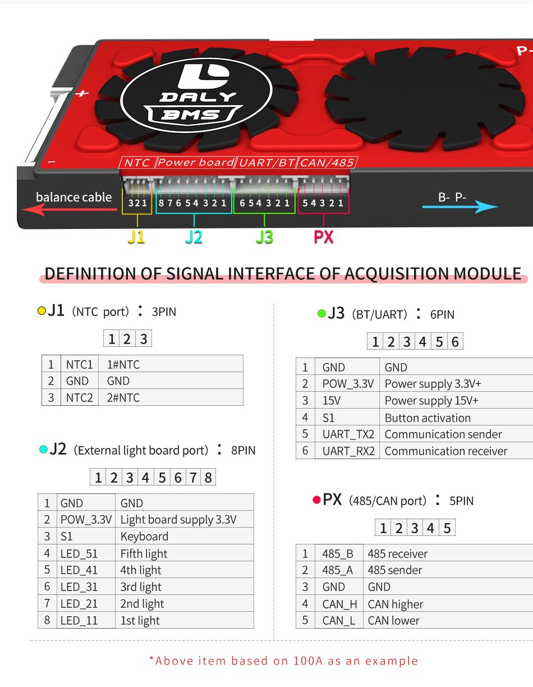

# uros_DalyBMS

This project interfaces a Daly BMS with an ESP32 microcontroller using the ESP-IDF framework and micro-ROS. The project is written in C++ and C, utilizing several components to handle serial communication, GPIO handling, and battery state management.

## Project Structure

The main components of the project include:

- **main.cpp**: Main entry point of the application.
- **battery_helper.cpp/hpp**: Source and header files for managing the battery state.
- **esp32_serial_transport.c/h**: Source and header files for handling serial transport specific to ESP32.
- **gpio_handler.cpp/hpp**: Source and header files for managing GPIO interactions.
- **uros_entities.cpp/hpp**: Source and header files defining entities for micro-ROS integration.
- **CMakeLists.txt**: CMake configuration file to compile the project.
- **Kconfig.projbuild**: Project configuration for ESP-IDF.
- **sdkconfig.defaults**: Default SDK configuration.
- **app-colcon.meta**: Metadata for Colcon build system.

## BMS Wakeup and MOSFET Control

The DALY BMS wakeup is handled by the trigger_bms_wakeup function, which activates or deactivates the GPIO pin configured to wake up the BMS. When this pin is activated, it sends a signal to wake up the BMS.

The discharge MOSFET is controlled via the set_discharge_mosfet function of the DalyBMS class. This function is called after a delay of 2 seconds following the BMS wakeup trigger.

## Additional Pins and Wakeup Procedure
  
the DALY BMS has additional pins:

- **J3-Pin_2** (Power Supply 3.3V): This pin is only part-time active as the BT dongle shall go to sleep.
- **J3-Pin_4** (Button Activation): This pin can be used to wake up the BMS. To do so, briefly short this pin to ground.

In this project, to wake up the BMS and read its values, you can use an optocoupler for safe activation. Connect the optocoupler output transistor's emitter to ground and collector to pin 4 on the BMS. The input of the optocoupler is connected via a resistor to one of the ESP32's GPIO pins, with the other input pin connected to ground.

This method ensures that the BMS can be reliably awakened for communication without continuous power from the BMS itself, which can save energy and maintain reliable operation.

## Configuration

Configuration is handled through the `Kconfig.projbuild` file and during the initialization of the classes and components. Specific parameters such as GPIO numbers and serial configurations are set in the respective initialization functions.

## Usage

To use this firmware, follow these steps:

1. **Install dependencies**: Ensure the ESP-IDF framework and micro-ROS are properly installed and configured.
2. **Add Component**: Use `git submodule update --init --recursive` to initialize and update the components.
3. **Set Target**: Use `idf.py set-target esp32s3` to set the target to ESP32S3.
4. **Configuration**: Use `idf.py menuconfig` to modify "Component - LEDRGB settings" and "Component - DalyBMS GPIO Settings" as needed.
5. **Build**: Use `idf.py build` to compile your project.
6. **Flash**: Use `idf.py flash` to flash the firmware to your ESP32*.
7. **Monitor**: Use `idf.py monitor` to monitor the serial messages sent by the ESP32*.

### Running with ROS 2

To run the micro-ROS agent and interact with the service, follow these steps:

1. **Run the micro-ROS agent**:
    ```sh
    ros2 run micro_ros_agent micro_ros_agent serial --dev /dev/ttyUSB0
    ```

2. **Echo the topic data**:
    ```sh
    ros2 service call  /DalyBMS_Service dalybms_interfaces/srv/GetBatteryState "{}"
    ```

This will allow you to request data from the ESP32 firmware using the ROS 2 service interface.


## License

This project is licensed under the MIT License. See the [LICENSE](LICENSE) file for details.

## Contributions

Contributions are welcome! Please submit a pull request or open an issue to discuss any changes you wish to make.

## Authors

- [Lionel ORCIL](https://github.com/ioio2995)